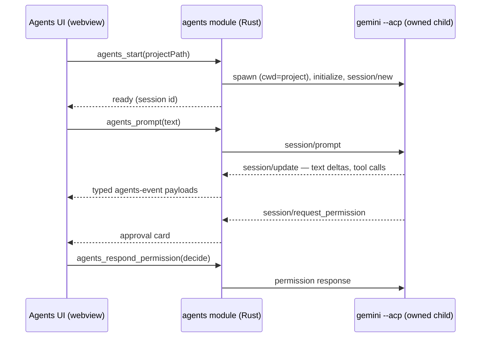

# Fracta v0 Technical Specification

## Context

Fracta v0 combines three mature but differently shaped local systems. RepoGraph
is a SvelteKit/Tauri viewer for code scan JSON, daily-log JSON, and a generated
Observatory snapshot. Fractorches is a Go service with a SQLite archive, mature
provider parsers, query services, HTTP/SSE APIs, and an existing Svelte client.
Fractapad is a SvelteKit/Tauri Markdown application.

A live audit on 2026-08-29 found that RepoGraph's generated snapshot is not a
reliable canonical session source. Its 693-session snapshot was materially
different from the 1,065 active sessions in the Fractorches archive. It missed
whole provider families, over-ingested Qoder, mixed OpenCode agent names with
provider identity, interpreted messages differently per source, and estimated
tokens and costs. Its UI also failed to apply its visible date range globally,
cached data for the process lifetime while claiming live status, and rendered
some payload fields with incompatible shapes. `docs/data-stream-audit.md`
records the evidence.

The external RepoGraph working copy is being changed by another agent. Its
source is imported only after an explicit handoff and a pinned provenance
record. Fractorches and Fractapad are stable enough to proceed independently.

## Proposed changes

### 1. Repository and application boundaries

One application at the repository root, plus one service:

```text
src/                    Fracta application (SvelteKit; Knowledge and
                        Observatory modes under one window)
src-tauri/              Desktop shell; owns the Fractorches sidecar
static/                 Static assets
tests/                  Frontend unit tests
services/
	fractorches/        Go archive, query service, and sidecar source
docs/
	upstream/           pinned provenance and compatibility notes
```

Root commands: `pnpm sidecar` builds the sidecar binary into
`src-tauri/binaries/`, `pnpm dev` runs the web dev server, and
`pnpm tauri dev` runs the desktop application with its owned sidecar.

The two applications do not share a new navigation shell in v0, satisfying B1,
B2, and B3. Shared packages are introduced only after real duplication exists;
the repository does not begin with empty abstraction packages.

### 2. Upstream capture and provenance

Import each upstream through a reproducible manifest containing its upstream
name, license, source revision when available, content hash, import date, and
local modifications. Where a local source has no Git metadata, create a
deterministic file manifest before import rather than claiming a commit pin.

RepoGraph import waits for the external handoff. The integrator compares the
handoff against the audited snapshot and records changes affecting data routes,
scan schemas, daily-log schemas, navigation, or styling before implementation.

### 3. Fractorches service integration

Retain the Go backend and its SQLite archive. Do not port it to JavaScript or
Rust. Observatory consumes the service's versioned HTTP/SSE API and generated
TypeScript client for behavior B4 through B12.

The Observatory Tauri wrapper starts the Fractorches sidecar on loopback using
an isolated port and waits for its health endpoint before loading data. The UI
must expose sidecar startup, sync, stale, and request failures. Desktop shutdown
must stop only the sidecar process it owns.

Use existing Fractorches endpoints for sessions, transcript messages, usage,
activity, trends, quality, recall, pins, recent edits, settings, search, and live
sync. If a required endpoint is absent, add it to Fractorches with storage and
API tests; do not reconstruct the result from raw provider files in the UI.

All visible filters are sent to the query service. Aggregate requests and list
requests share the same normalized filter object so B7 cannot drift between
cards and tables. Semantic and hybrid modes remain absent until their real
Fractorches queries are wired, satisfying B11 and B25.

### 4. RepoGraph scan JSON

Preserve the Registry, Layout Map, System & Flows, Boundary Rules, and Health
Treemap pipeline for B13 and B14. Replace direct arbitrary filesystem joins with
a small sidecar API that:

- reads a configured RepoGraph scan root;
- validates project slugs against `registry.json`;
- allows only the declared scan types;
- rejects traversal and symlink escapes;
- validates required version, project, scan, node, edge, group, file, statistic,
  flow, and note shapes for the requested view;
- returns explicit unavailable and invalid-payload errors.

The project switcher for graph views is deliberately separate from the session
project filter because their domains are different.

### 5. Daily-log JSON

Preserve RepoGraph's calendar and daily timeline for B15 and B16. Replace the
hardcoded local directory with a user-configurable daily-log root stored in
Fracta settings. The sidecar validates the index schema and selected ISO date,
then reads only the file named by the validated index entry.

Daily-log browsing, commits, agent sessions, and handoffs remain source fields.
Fractorches may provide links to canonical sessions when an entry has a stable
session identity, but it does not overwrite the daily-log record.

### 6. Observatory UI adapter

Import the handed-off RepoGraph UI into the Observatory mode and replace its
`observatory.json` state with typed Fractorches resource stores. Remove the
extractor and all fallback arrays, fixed metric values, heuristic cost maps,
fabricated quality scores, and fake live indicators from production paths.

Each route owns a real resource state with request identity, data, generation or
sync timestamp, loading state, stale state, and typed error. Refresh bypasses
the client cache and updates all resources sharing the active filter. Exports
are generated from the same canonical filtered query as the visible result.

### 7. Knowledge port

Import Fractapad as the Knowledge mode and preserve B17 through B20 before
renaming or restyling. Remove upstream version endpoints, repository release
links, updater configuration, update menu items, and upstream product branding.
No update control ships until a Fracta-owned updater completes end to end.

Retain its Tauri filesystem workflows but narrow permissions to the files and
folders the user selects. Replace an unrestricted content security policy with
the minimum policy required by the verified Markdown, Mermaid, KaTeX, Marp, and
PDF workflows.

### 7.1 Knowledge workspace completion

Treat the FractalNotes checkout as the feature benchmark for a mature local
notes workspace, and the retained Fractapad renderer and document workflow as
the compatibility baseline. Complete B18 by restoring the routed Knowledge page
as a page (not a route layout), mounting its style cascade only while Knowledge
is active, and keeping all existing document lifecycle behavior intact.

The persistent Library owns no competing document state. It reads the existing
pinned-folder and recent-file stores, uses the existing validated native folder
listing command, and opens a selected path through the same `openFile` flow as
the file picker, links, native menu, and OS open events. Folder selection uses
the native dialog; it persists only an explicit user choice. A folder listing
reports loading, no Markdown files, or unavailable data truthfully and skips
hidden and non-content directories through the native command's established
rules.

The workspace composition keeps the Library and document canvas in the same
mode-scoped page. The Library is omitted only for the already-working zen state;
no responsive or visual simplification may remove an available file action.
New layout rules are authored in the root indented Sass contract and use
Fractalstyler2 tokens, while imported Fractapad component styles remain the
compatibility baseline until individually migrated.

Verification for B18 includes: type checking; existing renderer, text-search,
watcher, slide, syntax-highlight, and RTL tests; a production build; native
launch; and manual desktop acceptance that pins a real folder, expands its
listing, opens a pinned and a recent file, removes shortcuts without touching
data, opens two tabs with independent edits, saves an unsaved note, and confirms
the read/raw/edit/split and rich Markdown flows remain functional.

### 7.2 Wiki surface and private article store

The Wiki surface maintains local knowledge articles over the Fractorches
recall corpus (decision D010, behavior B26). A Rust wiki module resolves the
article root as the `FRACTA_WIKI_ROOT` override, then the app folder's
Git-ignored `wiki/` directory, then `~/.fracta/wiki`; it creates only the
missing `entries/` directory and never deletes or rewrites an existing store.
Article listing, reading, and writing run through Tauri commands. Articles are
Markdown with a strict frontmatter (identity, title, type, status, summary,
tags, chat citations, timestamps); malformed files are skipped and counted,
never rendered half-valid.

The corpus browser is fed exclusively by the Fractorches recall HTTP API: the
frontend client pages `/recall/entries` with server-side text, type, and
review-state filters and reports truncation past its client cap. Corpus
entries render review state, trigger, uncertainty, model confidence, and a
source-session citation that opens the real session in the Observatory
transcript viewer. No provider transcript is parsed outside the service,
satisfying B4 and B5.

Wiki state uses Svelte 5 runes classes for the article store, the corpus
state, and a shared view facade. Every value on the surface is measured from
the article store or the corpus, with distinct loading, empty, unavailable,
error, and truncated states (B8, B9, B10, B25, B26). Verification covers
entry-format unit tests, the Rust store tests, `svelte-check`, the production
build, and the privacy gate.

Draft compilation (decision D011) reuses the service's generation machinery
instead of adding a client-side model path. The service exposes
`GET /api/v1/wiki/compile/status`, which reports availability it has actually
probed (the configured OpenAI-compatible insights endpoint, or insight agent
CLIs resolved on PATH), and `POST /api/v1/wiki/compile`, which loads the
requested recall entries read-only, rejects unknown or archived/superseded
ids, and prompts the model to ground every claim in the entries with
`[recall:<id>]` citations and an explicit "(unverified)" marker where
provenance is not verified. The response carries the draft markdown plus
per-entry provenance; the handler persists nothing. The frontend compile
panel shows the probed availability, the selected cluster, and the service's
error messages verbatim; a draft lands in the private article store only
after the user reviews the rendered markdown, its grounding provenance, and
the draft type. Saved drafts record `compiledFrom` (the grounding recall
entry ids) and `compiledAt`; a freshness check compares `compiledAt` against
the grounding entries in the loaded corpus view and reports fresh, stale
(which entries changed), or untestable — never a guessed verdict.

### 8. Styling, theming, and icons

Install Sass in each application with `pnpm add -D sass`. Record the imported
legacy style baseline. Imported styling may remain to preserve behavior, but no
new CSS, SCSS, Tailwind utility, inline style, or component style block may be
added. A touched visual rule moves to an indented `.sass` module and uses the
Fractalstyler2 semantic token/fractal contract.

Because Knowledge already exposes theme behavior, its retained light/dark mode
must be implemented through Fractalthemer's complete token mapping rather than
an independent variable set. Newly needed icons come from Fractalicons. Existing
icon migration is performed when necessary for a touched feature and must not
leave two competing new icon systems.

### 9. No-placeholder release gate

Production sources and built navigation are checked for:

- placeholder, demo, sample, mock, TODO-only, and coming-soon feature paths;
- inert buttons, tabs, keyboard hints, selectors, and exports;
- hardcoded metric arrays, token multipliers, pricing fallbacks presented as
  observed totals, and fixed quality or velocity values;
- the removed RepoGraph session extractor and Fractapad upstream endpoints;
- newly authored `.css` or `.scss`, inline style attributes, component style
  blocks, foreign tokens, or unauthorized icon dependencies.

A scanner finding is reviewed rather than blindly ignored. Legitimate fixture
and test uses must be explicitly scoped outside production bundles. This gate
enforces B8, B9, B10, B21, B24, and B25.

### 10. Agents surface — slice 1: Gemini CLI chats

Implements the Agents Surface section of `PRODUCT.md` (first slice): real
Gemini CLI chats in the one window, scoped per project folder, with explicit
user approvals, recorded by the canonical Fractorches archive. The numbered
invariants in that section are referenced here as (P1)–(P15).

#### Context

Facts this plan rests on (verified 2026-09-05):

- `gemini` 0.40.1 at `/opt/homebrew/bin/gemini` supports `--acp`: the Agent
  Client Protocol, JSON-RPC over stdio — the same interface Zed's agent panel
  speaks. Driving it needs no PTY and no terminal scraping. Antigravity state
  lives under `~/.gemini/antigravity-cli`; it is not the slice-1 binary.
- Fractorches already parses Gemini CLI transcripts
  (`services/fractorches/internal/parser`: `AgentGemini`, `GeminiSessionID`,
  Gemini fixtures), so chats conducted here appear in the Bench under the real
  gemini provider identity with zero new parser work (P12).
- The Gemini CLI owns its session store under `~/.gemini`; Fracta stores only
  pointers and proves resume by asking the agent (P9).

The shell already declares the seam this slice opens:

- `AppView` already contains `'agents'`, gated out of rendering by
  `BUILT_VIEWS` —
  [`src/lib/states/windowState.svelte.ts:2-10 @ 60cf072`](https://github.com/fractalmandala/theFracta/blob/60cf07249948e33d2ae7553c1298c561359fd105/src/lib/states/windowState.svelte.ts#L2-L10).
  The slice adds `'agents'` to `BUILT_VIEWS`.
- The switcher is a `surfaces` array with a ⌘N handler regexed to `1-3` —
  [`src/routes/+layout.svelte:29-33 @ 60cf072`](https://github.com/fractalmandala/theFracta/blob/60cf07249948e33d2ae7553c1298c561359fd105/src/routes/+layout.svelte#L29-L33),
  [`58-64 @ 60cf072`](https://github.com/fractalmandala/theFracta/blob/60cf07249948e33d2ae7553c1298c561359fd105/src/routes/+layout.svelte#L58-L64).
  The slice adds the entry, widens the regex to `1-4`, and mounts the module
  the same way Notes/Bench/Wiki mount (P1).
- Commands register in `lib.rs` `generate_handler` and are plain functions
  returning `Result<T, String>` —
  [`src-tauri/src/lib.rs:88-109 @ 60cf072`](https://github.com/fractalmandala/theFracta/blob/60cf07249948e33d2ae7553c1298c561359fd105/src-tauri/src/lib.rs#L88-L109).
- Process ownership precedent: `sidecar.rs` holds its spawned child in
  `Mutex<Option<Child>>` and kills+waits it on `RunEvent::Exit` —
  [`src-tauri/src/sidecar.rs:16-95 @ 60cf072`](https://github.com/fractalmandala/theFracta/blob/60cf07249948e33d2ae7553c1298c561359fd105/src-tauri/src/sidecar.rs#L16-L95).
  Agent sessions follow the same pattern per process, plus `Drop` cleanup.
- Quit already routes through the frontend guard `window.__fracta_quit`
  (close-requested and menu quit) —
  [`src-tauri/src/lib.rs:117-130 @ 60cf072`](https://github.com/fractalmandala/theFracta/blob/60cf07249948e33d2ae7553c1298c561359fd105/src-tauri/src/lib.rs#L117-L130).
  The active-session quit warning (P10) extends that guard.

#### Proposed changes

Rust — `src-tauri/src/agents/` (new module):

- `AgentState` (managed) owns the session map and enforces the cap of three
  concurrent sessions (P7).
- Each `AgentSession` owns the spawned `gemini --acp` child (piped stdio,
  `cwd` = project path), a writer for JSON-RPC requests, and a reader thread
  that parses newline-delimited JSON-RPC and forwards typed events to the
  webview via `app.emit`. `std::process` + std threads, mirroring
  `sidecar.rs`; no async runtime is introduced.
- Hand-rolled ACP subset only: `initialize`, `session/new`, `session/prompt`,
  `session/update` (text deltas, tool calls), `session/request_permission`,
  `session/cancel`, `session/load`. No protocol crate; the dialect is pinned
  by fixtures.
- Commands: `agents_start(project_path)` (cap check, spawn, initialize →
  session id), `agents_prompt`, `agents_respond_permission`, `agents_cancel_turn`,
  `agents_close`, `agents_resumable(project_path)`, `agents_resume` (via
  `session/load`). Errors return verbatim strings for the UI to show (P3, P11).
- Pointer store: a small JSON file in the app config directory recording
  project path, CLI session id, and timestamps per session. It is a pointer
  cache, not a transcript; the CLI's store stays canonical and is never read
  or parsed by Fracta (no transcript parsing outside Fractorches).
- Lifecycle: `RunEvent::Exit` and `Drop` kill+wait every owned child (P10).
  `agents_close` ends one session's process; its pointer remains for resume.

Frontend:

- `windowState`: add `'agents'` to `BUILT_VIEWS`; layout: entry, ⌘1-4, module
  mount.
- `src/lib/states/agentsState.svelte.ts`: runes store holding sessions by id —
  phase (`starting` / `ready` / `streaming` / `waiting-approval` / `error` /
  `failed` / `exited`), transcript entries (user prompts, accumulated assistant
  text, tool cards, approval cards, verbatim errors), cap state, and the event
  listener applying `agents-event` payloads. The store lives at app scope, not
  module scope, so sessions keep running and transcripts catch up when the
  user returns from another surface (P8).
- `src/lib/modules/agents/`: session list grouped by project, chat pane with
  streaming text, collapsed-by-default expandable tool cards (P5), approval
  cards with Approve/Deny (P6), Stop (P4), and truthful empty, error, and
  disabled-composer states (P3, P13). Composer enabled only when the session
  can receive prompts.
- Project picking reuses the dialog plugin already initialized
  (`tauri_plugin_dialog`) the way Notes pinned folders do (P2).
- Styling: new indented `.sass` authored against the Fractalstyler2 contract
  with module-scoped classes; no component `<style>` blocks, no inline styles.
  Shared contract files are touched only in coordination with the styling lane.
- Capabilities: confirm the webview can `listen` to Rust-emitted events
  (`core:event` permissions in `src-tauri/capabilities/`); grant narrowly if
  absent.



Tradeoffs:

- `std::process` + threads over tokio: matches the existing sidecar pattern
  and adds no runtime; ACP traffic is low-rate line JSON.
- Hand-rolled ACP subset over a protocol crate: the slice uses seven methods;
  a fixture-driven fake agent pins the dialect and catches CLI drift at test
  time.
- Pointer store over reading `~/.gemini` directly: the CLI's store format is
  its own; resume validity is proven by `session/load`, not file inspection.

#### Testing and validation

- Rust: `cargo fmt`, `cargo clippy`, `cargo test`. Unit tests run the ACP
  client against a fake agent binary speaking canned JSON-RPC from fixtures:
  lifecycle happy path, permission round-trip, cancel mid-turn, malformed line
  tolerance, child exit → failed state, cap enforcement, kill-on-close/exit.
  Covers P3, P4, P5, P6, P7, P11.
- Frontend: vitest over `agentsState` (phase transitions, delta accumulation,
  approval application, cap message, true-empty new chat), `svelte-check`,
  production build. Covers P3, P4, P7, P13.
- Desktop acceptance (manual, real `gemini`, scratch project fixture): P1
  switcher + ⌘4; P2 start via folder picker; P4 streamed answer and stop
  mid-turn; P5 tool card expand; P6 approve and deny a real permission; P7
  three sessions across two projects plus the truthful cap message; P8 switch
  to Notes mid-run and return caught up; P9 close and resume with restored
  history; P10 quit warning with active sessions and no orphaned `gemini`
  processes afterward (checked with `ps`); P11 quota/429 error shown verbatim;
  P12 the session visible in the Bench as a gemini session with messages and
  usage; P14 keyboard pass over composer, cards, Stop, approve/deny; P15
  folder-moved error path.
- Release gate: the no-placeholder scan runs over the new module and built
  navigation.

#### Parallelization

Not proposed for this slice. The Rust command/event contract and the UI that
consumes it churn together during first implementation, so splitting them into
lanes adds contract-sync overhead on a small vertical. Later work (Antigravity
adapter, wiki/notes MCP bridge) is cleanly separable then.

#### Risks

- Gemini CLI ACP drift across versions: fixture tests pin the dialect; a CLI
  update that breaks framing fails tests before shipping.
- Orphaned processes on hard crash: kill+wait on `RunEvent::Exit` and `Drop`;
  acceptance includes the `ps` check after forced quit. Escalate to
  process-group kill on macOS if orphans appear.
- Event volume: assistant deltas coalesce per frame on the frontend; tool
  payloads are small. If volume grows, Rust-side coalescing is the follow-up —
  never silent dropping.
- Resume history: what `session/load` replays is the agent's choice; the UI
  renders what the agent restores and never fabricates missing history
  (P9, P13).

#### Follow-ups

- Slice 2 candidates: wiki/notes context for agents via extending the
  read-only `agentsview mcp`; Antigravity as a second adapter; richer tool and
  diff cards.

## Testing and validation

- **Service:** run existing Go tests plus endpoint, filter parity, provenance,
  scan-path, schema-validation, daily-log, SSE, and sidecar lifecycle tests.
  Run `go fmt ./...` and `go vet ./...` after Go changes.
- **Observatory:** run unit tests for typed adapters and filters, component tests
  for every data state, `svelte-check`, production build, and browser tests
  against an isolated Fractorches archive plus real scan and daily-log fixtures.
- **Knowledge:** run existing Fractapad tests, `svelte-check`, production build,
  Rust formatting/lint/tests, and desktop workflows for file entry, editing,
  conflicts, rich Markdown, presentations, and PDF output.
- **Cross-source parity:** on a frozen archive, compare Observatory session,
  message, project, model, usage, cost, and active-day totals with the same
  Fractorches API responses for identical filters.
- **Desktop:** verify clean launch, sidecar readiness, shutdown ownership,
  offline operation, file associations, permissions, and packaging for both
  interfaces.
- **Release gate:** run the no-placeholder and styling scans against source and
  production bundles. No waiver permits a visible pseudo-feature.
- **Human acceptance:** present both functioning desktop interfaces and their
  core real-data workflows for user review. Automated checks are evidence, not
  a substitute for acceptance.

## Parallelization

After this specification baseline is committed, implementation uses isolated
worktrees with non-overlapping ownership:

1. **Fractorches service lane:** import the service, preserve its tests, and add
   only the scan/daily-log or Observatory API gaps. It does not edit either app.
2. **Knowledge lane:** imported and ported Fractapad, removed tethers, and
   preserved its workflows (complete).
3. **Observatory lane:** imported the RepoGraph UI as the Observatory mode and
   replaced the generated Observatory pipeline with the Fractorches client
   (complete). It does not edit the Go service.
4. **Integrator lane:** owns root configuration, specifications, records,
   dependency policy, cross-app verification, and integration order.
5. **Wiki lane:** the private article store, corpus browser, and measured
   telemetry over the Fractorches recall API (Phase 1). It does not edit the
   Go service, Observatory views, or authored styles.

Each lane commits coherent changes. The integrator reviews diffs, resolves
contract questions, integrates one lane at a time, and runs full gates after
every integration. Parallel work stops where a schema or root configuration
change would create overlapping ownership.
