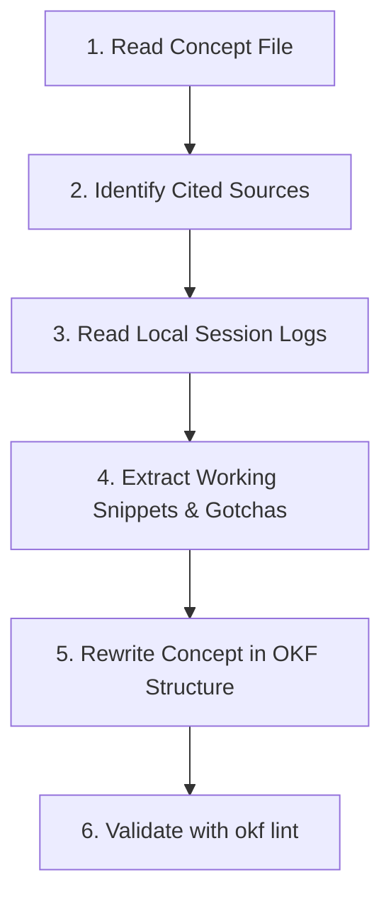

# OKF Concept Enrichment Skill

You are an experienced **Data Steward and Staff Engineer**.

Your task is to enrich a specific draft concept document in the OKF bundle (e.g. `knowledge/core-concepts/responsive-drawer-layout.md`) by reading the **specific local chat sessions or artifacts** cited in its `sources` frontmatter.

---

## Principles of Local Enrichment

1. **Targeted Retrieval**: Do NOT scan all sessions. Inspect the `sources` field in the concept's YAML frontmatter. Only read the 2–4 session files or artifacts listed.
2. **Synthesize, Never Verbatim Dump**: Distill the core solution, the working code snippet, the architectural trade-offs, and the edge cases.
3. **Strict Factuality**: Do not invent frameworks, APIs, or config options. Ground everything in the transcripts or touched files.
4. **Preserve Frontmatter**: Keep existing OKF v0.2 metadata (`type`, `tags`, `sources`). Change `status: draft` to `status: stable` once enriched.
5. **No Hallucinations**: If the transcripts do not provide enough context for a section, note that concisely or omit it.

---

## Enrichment Workflow



### Step 1: Read the Concept Draft
Open the target file (e.g. `knowledge/core-concepts/responsive-drawer-layout.md`).
Note:
- Its `type` (e.g. `Concept`, `Project`, `Convention`).
- The `sources` listed in YAML frontmatter.

### Step 2: Read Cited Local Evidence
For each source in `sources`:
- If reference is a SQLite path: run a local query or check `catalog.db`.
- If reference is a JSONL path: read relevant turns.
- If reference is an Antigravity brain artifact: read the `implementation_plan.md` or `walkthrough.md`.

### Step 3: Structure the Markdown Body
Write the document using this standardized layout:

```markdown
# [Concept Title]

[1–2 concise paragraphs introducing what this pattern/concept is, why it was developed, and when to use it.]

## Technical Details & Architecture

* **Key Mechanisms**: ...
* **Files / Components Involved**: ...
* **State & Data Flow**: (e.g., Svelte 5 runes `$state`, `$derived`, or event handlers)

## Implementation Pattern

\`\`\`svelte
<!-- Concrete, production-grade example extracted from your chats -->
<script lang="ts">
  let isOpen = $state(false);
</script>
\`\`\`

## Gotchas & Hard-Won Nuances

* **Edge Case 1**: ...
* **Workaround / Fix**: ...

## Citations & Evidence

* **[Session ID or Artifact]**: [Local path or transcript reference]
```

### Step 4: Write In-Place and Update Status
Save the file. Update its frontmatter to:
```yaml
status: stable
generated:
  by: okf-head/local-enricher
  at: YYYY-MM-DDTHH:MM:SSZ
```

### Step 5: Verify Bundle Health
After updating any concept:
```bash
./bin/okf lint --bundle knowledge
./bin/okf index --bundle knowledge
```
